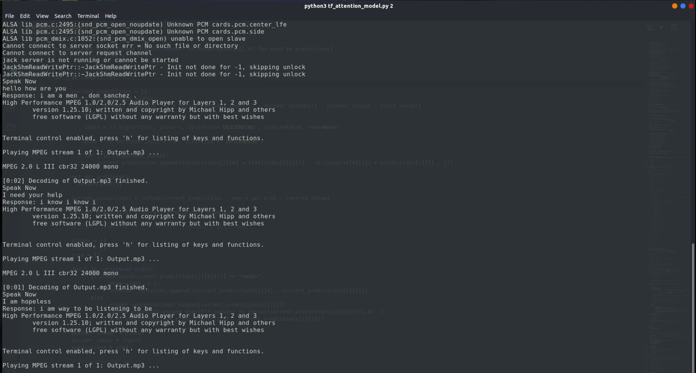

# Conv_bot

This repo contains the work done for the summer project - making a conversational bot.:robot:

Group :

[Varun Khatri](https://github.com/varunk122), [Prateek Jain](https://github.com/Prateekjain09), [Adit Khokhar](https://github.com/adit-khokar), [Atharva Umbarkar](https://github.com/AtharvaUmbarkar), [Ishir Roongta](https://github.com/isro01)

(P.S. For checkpoints contact any of the above mentioned :smiley: )

---

## Installation and usage 

The requirements are in the requirements.txt file.
* `pip install -r requirements.txt `
* `python3 -m spacy download en`

The main file to focus is tf_attention_model.py.

To run the bot ->
`python3 tf_attention_model.py -d False`

A demo video  : 

---

## Project Brief

The main aim of this project was to make a conversation bot able to take in audio input and output a meaningful reply keeping in mind factors like context ant intent in the input given by user.

The three main parts of this project were:

1. Speech to text
2. Topic attention (to generate a response)
3. Text to speech

### CTC_MODEL

This model is implemented to convert the audio messages of the user into text.

Please look at the file [ctc_model.py](https://github.com/isro01/Conv_bot/blob/master/ctc_model.py) for the proper implementation.

### CTC_Model Output

  

### ENCODER - DECODER MODEL

This model is implemtented to cover the response generation part of the conversational bot.

  
  

### LDA MODEL 

This model is implemented to add topic awareness to ENCODER - DECODER Model for better response generation by focusing it's "attention" to only specific parts of the input rather than the whole sentence.

### Optimal Number of Topics

This graph shows the optimal number of topics we need to set for news articles dataset.

  

### Gensim LDA Model parameters

* **corpus** —   Stream of document vectors or sparse matrix of shape (num_terms, num_documents) <
* **id2word** – Mapping from word IDs to words. It is used to determine the vocabulary size, as well as for debugging and topic printing.
* **num_topics** — The number of requested latent topics to be extracted from the training corpus.
* **random_state** — Either a randomState object or a seed to generate one. Useful for reproducibility.
* **update_every** — Number of documents to be iterated through for each update. Set to 0 for batch learning, > 1 for online iterative learning.
* **chunksize** — Number of documents to be used in each training chunk.
* **passes** — Number of passes through the corpus during training.
* **alpha** — auto: Learns an asymmetric prior from the corpus
* **per_word_topics** — If True, the model also computes a list of topics, sorted in descending order of most likely topics for each word, along with their phi values multiplied by the feature-length (i.e. word count)

### About pyLDAvis

* The size of the bubbles tells us how dominant a topic is across all the documents (our corpus)
* The words on the right are the keywords driving that topic
* The closer the bubbles the more similar the topic. The farther they are apart the less similar
* Preferably, we want non-overlapping bubbles as much as possible spread across the chart.

### Text to Audio

[gTTs](https://pypi.org/project/gTTS/), a python library was used to make a function to output audio from the generated responses.

---

### References you might find useful

* [For LDA model](https://arxiv.org/pdf/1608.02519.pdf)
* [For data augmentation](https://medium.com/@makcedward/data-augmentation-for-audio-76912b01fdf6)
* [For data generator class boiler plate](https://stanford.edu/~shervine/blog/keras-how-to-generate-data-on-the-fly)
* [Understanding ctc loss](https://stackoverflow.com/questions/57292896/understanding-ctc-loss-for-speech-recognition-in-keras)
